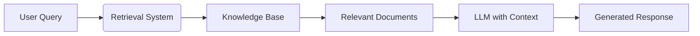

```markdown
<!-- meta: Learn how Retrieval-Augmented Generation (RAG) enhances AI models by combining retrieval and generation. Discover implementation tips, benefits, and best practices for building efficient RAG systems. -->
```

# Retrieval-Augmented Generation: The Key to Smarter AI Responses

In the rapidly evolving landscape of artificial intelligence, one challenge persists: how to make large language models (LLMs) more accurate, reliable, and knowledgeable without constant retraining. Retrieval-Augmented Generation (RAG) has emerged as a groundbreaking solution that fundamentally changes how AI systems access and utilize information. By combining the power of retrieval-based systems with generative models, RAG transforms how AI interacts with knowledge, delivering responses that are both contextually relevant and factually grounded.

## What is Retrieval-Augmented Generation?

Retrieval-Augmented Generation (RAG) is an AI framework that enhances the capabilities of large language models by integrating them with external knowledge retrieval systems. Unlike traditional LLMs that rely solely on their pre-trained parameters, RAG systems dynamically fetch relevant information from external sources before generating responses.



This hybrid approach allows AI systems to:
- Access up-to-date information beyond their training data cutoff
- Provide verifiable, fact-based responses
- Reduce hallucinations and inaccuracies
- Handle specialized knowledge domains effectively

## Why RAG Matters for Modern AI Applications

The limitations of pure LLMs become apparent when dealing with:
- Recent events or rapidly changing information
- Specialized domain knowledge
- Factual accuracy requirements
- Transparency and verifiability needs

RAG systems address these challenges by creating a symbiotic relationship between retrieval and generation components. This results in AI applications that are more trustworthy, adaptable, and capable of handling complex queries.

> 💡 **Tip:** RAG systems can reduce hallucinations by up to 60% compared to standalone LLMs, according to recent research from Stanford AI Lab.

## How RAG Works: A Technical Deep Dive

### The Retrieval Component

The retrieval system acts as the "memory" of the RAG architecture. When a user query is received, this component:

1. **Embeds the query** into a vector representation using embedding models like OpenAI's text-embedding-ada-002 or open-source alternatives like Sentence-BERT.

```python
from sentence_transformers import SentenceTransformer

# Load pre-trained embedding model
model = SentenceTransformer('all-MiniLM-L6-v2')

# Convert query to vector embedding
query_embedding = model.encode("How does RAG improve AI accuracy?")
```

2. **Searches the knowledge base** using vector similarity to find the most relevant documents or passages.

```typescript
import { PineconeClient } from "@pinecone-database/pinecone";

// Initialize Pinecone client
const pinecone = new PineconeClient();
await pinecone.init({
  apiKey: process.env.PINECONE_API_KEY,
  environment: "us-west1-gcp"
});

// Query vector database
const queryResponse = await pinecone.Index({
  indexName: "knowledge-base",
  queryRequest: {
    vector: queryEmbedding,
    topK: 5, // Retrieve top 5 most relevant documents
    includeMetadata: true
  }
});
```

3. **Ranks and filters** results to ensure only the most relevant information is passed to the generator.

### The Generation Component

Once relevant information is retrieved, the generation component:

1. **Constructs a prompt** that includes both the original query and the retrieved context.

```markdown
[CONTEXT]
Retrieval-Augmented Generation (RAG) combines retrieval systems with generative models to enhance AI responses. It reduces hallucinations by providing factual grounding and allows access to up-to-date information.

[QUESTION]
How does RAG improve AI accuracy?

[ANSWER]
```

2. **Feeds the augmented prompt** to an LLM like GPT-4, Llama 2, or Claude.

```typescript
import { OpenAI } from "openai";

const openai = new OpenAI({
  apiKey: process.env.OPENAI_API_KEY
});

const response = await openai.chat.completions.create({
  model: "gpt-4",
  messages: [
    { role: "system", content: "You are a helpful assistant that answers questions based on the provided context." },
    { role: "user", content: augmentedPrompt }
  ],
  temperature: 0.3, // Lower temperature for more factual responses
  max_tokens: 500
});
```

3. **Generates a response** that incorporates both the model's learned knowledge and the retrieved information.

### Putting It All Together

The complete RAG pipeline operates in milliseconds, creating a seamless experience for users while maintaining factual accuracy:


*Complete RAG architecture showing the flow from user query to final response*

## Implementing a RAG System: A Step-by-Step Guide

### Step 1: Setting up the Knowledge Base

Your knowledge base is the foundation of your RAG system. It should contain:

- Structured documentation
- FAQs and support articles
- Technical specifications
- Product information
- Historical data

```bash
# Example directory structure for knowledge base
knowledge-base/
├── product-docs/
├── support-articles/
├── technical-specs/
└── company-policies/
```

> ⚠️ **Warning:** Ensure your knowledge base is regularly updated to prevent the RAG system from serving outdated information.

### Step 2: Choosing an Embedding Model

Select an embedding model that balances performance with efficiency:

| Model | Dimensions | Speed | Best For |
|-------|------------|-------|----------|
| text-embedding-ada-002 | 1536 | Fast | General purpose |
| all-MiniLM-L6-v2 | 384 | Very fast | Lightweight applications |
| text-embedding-3-large | 3072 | Medium | High-accuracy needs |

### Step 3: Building the Retrieval Mechanism

Vector databases are essential for efficient retrieval:

```python
# Using FAISS for local vector storage
import faiss
import numpy as np

# Create index
dimension = 1536  # Dimension of embeddings
index = faiss.IndexFlatL2(dimension)

# Add document embeddings to index
index.add(np.array(document_embeddings))

# Search for similar vectors
D, I = index.search(np.array([query_embedding]), k=5)
```

### Step 4: Integrating with an LLM

Connect your retrieval system to an LLM using prompt engineering techniques:

```typescript
function createPrompt(query: string, context: string): string {
  return `
    Context: ${context}
    
    Question: ${query}
    
    Instructions:
    - Answer based only on the provided context
    - If the context doesn't contain the answer, say "I don't have enough information to answer this"
    - Cite the sources used in your answer
  `;
}
```

## Best Practices for RAG Systems

### Document Chunking Strategies

Effective chunking is crucial for retrieval accuracy:

- **Fixed-size chunks:** Simple but may break semantic context
- **Semantic chunking:** Preserves meaning by splitting at natural boundaries
- **Hierarchical chunking:** Creates summaries at different levels of detail

```python
# Semantic chunking example
from langchain.text_splitter import RecursiveCharacterTextSplitter

text_splitter = RecursiveCharacterTextSplitter(
  chunk_size=1000,
  chunk_overlap=200,
  length_function=len,
  separators=["\n\n", "\n", ". ", " ", ""]
)

chunks = text_splitter.split_text(large_document)
```

### Vector Database Selection

Choose a vector database that fits your scale and performance needs:

| Database | Open Source | Cloud Hosted | Best For |
|----------|-------------|--------------|----------|
| Pinecone | No | Yes | Production applications |
| ChromaDB | Yes | Yes | Prototyping and small apps |
| Weaviate | Yes | Yes | Hybrid search needs |
| FAISS | Yes | No | High-performance local apps |

### Retrieval Optimization

Improve retrieval with these techniques:

1. **Hybrid search:** Combine keyword and vector search
2. **Re-ranking:** Apply models like BERT to refine initial results
3. **Query expansion:** Broaden search with related terms
4. **Metadata filtering:** Narrow results by date, category, etc.

```typescript
// Hybrid search example
const hybridResults = await pinecone.Index({
  indexName: "knowledge-base",
  queryRequest: {
    vector: queryEmbedding,
    topK: 10,
    filter: { category: "technical-specs" },
    includeMetadata: true
  }
});

// Re-rank results with a cross-encoder
const rerankedResults = rerankWithCrossEncoder(query, hybridResults);
```

## Common Challenges and Solutions

### Challenge: Handling Large Knowledge Bases

**Solution:** Implement hierarchical retrieval:
1. First, retrieve relevant document sections
2. Then, retrieve specific passages within those sections
3. Finally, extract exact sentences or phrases

```python
# Hierarchical retrieval example
def hierarchical_retrieval(query):
    # Step 1: Document-level retrieval
    doc_results = document_index.search(query, k=3)
    
    # Step 2: Section-level retrieval within those documents
    section_results = []
    for doc in doc_results:
        sections = section_index.search(query, doc_id=doc.id, k=2)
        section_results.extend(sections)
    
    # Step 3: Passage-level retrieval within sections
    passage_results = []
    for section in section_results:
        passages = passage_index.search(query, section_id=section.id, k=3)
        passage_results.extend(passages)
    
    return passage_results
```

### Challenge: Balancing Retrieval and Generation

**Solution:** Implement a confidence threshold:
- If retrieval confidence is high, rely more on retrieved content
- If retrieval confidence is low, rely more on the LLM's internal knowledge

```typescript
function generateResponse(query: string, retrievedDocs: any[]) {
  const avgScore = retrievedDocs.reduce((sum, doc) => sum + doc.score, 0) / retrievedDocs.length;
  
  if (avgScore > 0.8) {
    // High confidence in retrieved docs
    return generateWithHighContextWeight(query, retrievedDocs);
  } else if (avgScore > 0.5) {
    // Medium confidence
    return generateWithBalancedWeight(query, retrievedDocs);
  } else {
    // Low confidence, rely more on LLM
    return generateWithLowContextWeight(query, retrievedDocs);
  }
}
```

## Real-World Applications of RAG

### Customer Support

RAG systems power next-generation support chatbots that:
- Access product documentation in real-time
- Provide accurate troubleshooting steps
- Reference specific policies and procedures

> 📝 **Note:** Companies implementing RAG for customer support have seen 40-60% reduction in resolution time and 35% increase in customer satisfaction.

### Research and Analysis

Researchers use RAG to:
- Query vast scientific literature
- Synthesize information across multiple sources
- Generate literature reviews and summaries

### Enterprise Knowledge Management

Organizations implement RAG for:
- Internal knowledge bases
- HR policy queries
- Technical documentation access
- Compliance information retrieval

## Frequently Asked Questions

### What is the difference between RAG and fine-tuning?

Fine-tuning modifies the model's internal weights to incorporate new knowledge, which is computationally expensive and can lead to catastrophic forgetting. RAG, on the other hand, keeps the model static and augments its inputs with external information. This makes RAG more flexible, easier to update, and better at handling rapidly changing information.

### Can RAG be used with any LLM?

Yes, RAG is architecture-agnostic and can work with any LLM, including open-source models like Llama 2 and Mistral, as well as commercial APIs like OpenAI's GPT models and Anthropic's Claude. The key requirement is the ability to provide context through prompts.

### How do you evaluate the performance of a RAG system?

RAG evaluation typically combines metrics for:
- **Retrieval quality:** Precision, recall, and MRR (Mean Reciprocal Rank)
- **Response quality:** Faithfulness (does the answer use the context?), relevance, and helpfulness
- **End-to-end performance:** Task completion rate and user satisfaction

```python
# Example evaluation metrics
def evaluate_rag_system(queries, ground_truth):
    retrieval_scores = evaluate_retrieval(queries, ground_truth)
    generation_scores = evaluate_generation(queries, ground_truth)
    
    return {
        "precision@k": retrieval_scores["precision"],
        "recall@k": retrieval_scores["recall"],
        "faithfulness": generation_scores["faithfulness"],
        "relevance": generation_scores["relevance"]
    }
```

## Conclusion

Retrieval-Augmented Generation represents a significant leap forward in making AI systems more reliable, accurate, and useful. By combining the strengths of retrieval systems with generative models, RAG addresses many of the limitations that have hindered widespread adoption of AI in critical applications. As the technology continues to evolve, we can expect RAG systems to become even more sophisticated, with improved retrieval mechanisms, better integration techniques, and broader application across industries.

For organizations looking to implement AI solutions that require factual accuracy and up-to-date information, RAG is not just an option—it's rapidly becoming a necessity. The future of AI lies not just in what models can remember, but in how effectively they can access and utilize the vast repositories of human knowledge.
```