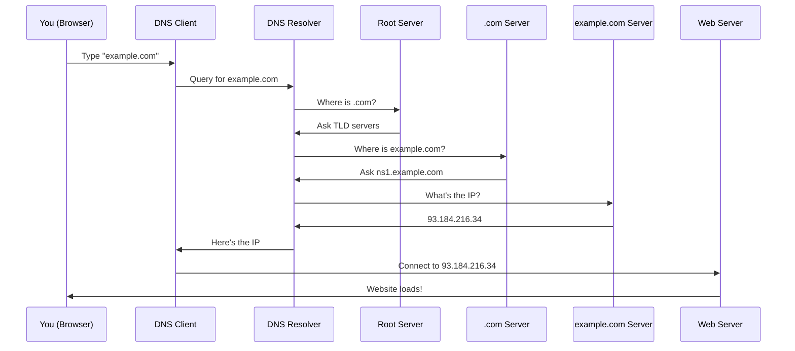
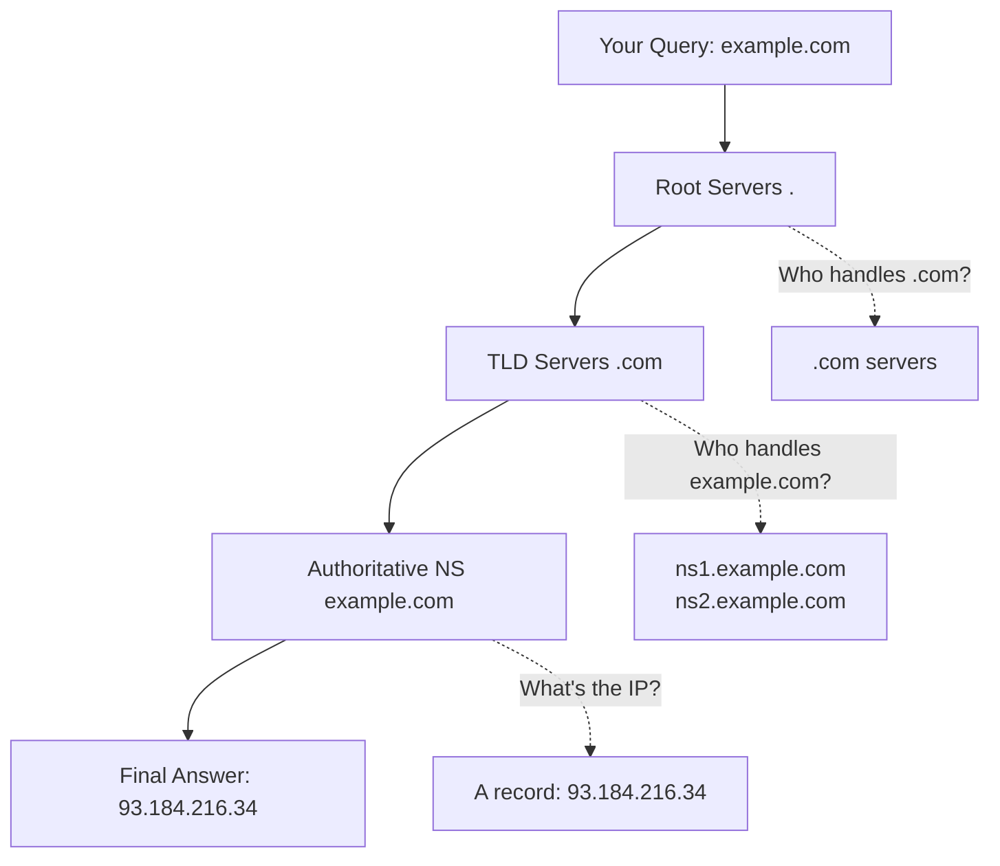
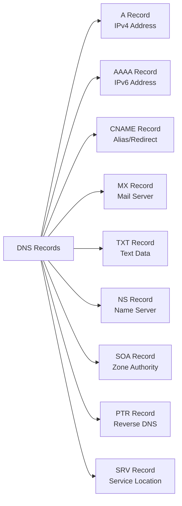
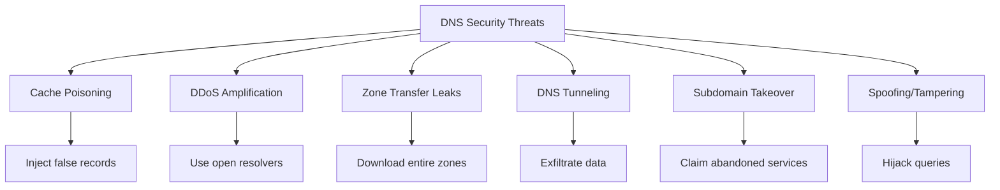

# DNS Security Guide: Understanding the Internet's Phone Book

```markdown
<!-- meta: Learn how DNS really works! Complete guide to domain name resolution with visual diagrams, practical examples, and essential security basics. -->
```

---

## What is DNS anyway?

**Domain Name Service (DNS)** — it's a network protocol that mainly works over **UDP** (port 53) and falls back to **TCP** for larger responses or zone transfers.  

In short: the client sends a DNS query to a DNS server and receives a response (an IP address). After that, the client connects to the web server at that IP (over TCP, e.g. HTTP/HTTPS). The browser does most of this work for us.

### Think of it like this:
DNS is like the internet's phone book. When you want to call "Pizza Place" you look up their number in the phone book. DNS does the same thing - when you type `google.com`, DNS looks up the "phone number" (IP address) so your computer knows where to connect.

---

## How it works (short flow)



1. You type `example.com` in the browser.
2. The OS/browser DNS *client* sends a DNS query to a configured DNS *resolver* (e.g., the one your ISP gives you or a public resolver like `8.8.8.8`). This usually goes over **UDP:53**.
3. The recursive resolver either answers from its cache or performs queries up the DNS hierarchy (root → TLD → authoritative name servers) to find the authoritative IP.
4. Resolver returns the IP to your client.
5. Your client opens a TCP connection to that IP and requests the web page (HTTP or HTTPS).
6. The server responds and the connection is established.

### More about DNS flow - what really happens under the hood:

When you type a website address, your computer doesn't magically know where that website lives. It has to ask around, kind of like asking for directions:

1. **First stop - your computer's memory**: "Do I remember this address?" (DNS cache)
2. **Second stop - your router**: "Hey router, do you know where google.com is?"
3. **Third stop - your ISP**: "ISP, can you help me find this website?"
4. **Final stops - the DNS hierarchy**: If nobody knows, we start from the top and work our way down

---

## Key definitions

- **DNS query**: a request asking for DNS data (commonly an IP for a domain).
- **DNS client / resolver (stub resolver)**: the software on your OS or device that asks a DNS server to resolve names. It gets DNS server addresses via DHCP from your ISP or you can set them manually (e.g., `8.8.8.8`).
- **Recursive DNS server (resolver)**: takes the client's query and performs the full resolution (may query other servers) and returns the final answer to the client.
- **Authoritative name server**: the server that holds the official DNS records for a domain and gives authoritative responses about that domain.
- **Name server vs DNS server**: in casual notes they're often used interchangeably. More precisely: an *authoritative name server* answers for zones it hosts; a *recursive resolver* answers clients by querying other name servers. Both are "DNS servers," but they play different roles.

### More about these roles - imagine a library system:

Think of DNS like a library system:
- **DNS Client** = You (the person looking for a book)
- **Recursive Resolver** = The librarian who helps you find books
- **Authoritative Name Server** = The specific shelf where the book actually lives
- **Root/TLD Servers** = The library catalog system that tells you which section to look in

---

## Ports & protocols

- **UDP 53**: main transport for queries/responses (fast, stateless).
- **TCP 53**: used for large responses and zone transfers (AXFR/IXFR), and when UDP responses are truncated.
- **DNS over TLS (DoT)** and **DNS over HTTPS (DoH)**: encrypt DNS queries to protect privacy and prevent on-path tampering.

### More about why different ports and protocols:

**Why UDP first?** 
- UDP is like sending a postcard - quick and simple
- No need to establish a connection, just send the question and get an answer
- Perfect for small, quick DNS queries

**When do we use TCP?**
- When the answer is too big for a postcard (UDP packet)
- When transferring entire DNS zones (like copying a whole phone book)
- When we need reliability for important operations

**Modern encrypted DNS (DoT/DoH):**
- Like putting your postcard in an envelope so nobody can read it
- Prevents your ISP or hackers from seeing what websites you're trying to visit

---

## Hierarchical process (how the resolver finds the IP)



DNS is hierarchical:
1. **Root servers**: the resolver starts here (or a cached pointer to them). Root servers point to the appropriate TLD servers (like `.com`, `.ir`).
2. **TLD name servers**: those point to the authoritative name servers for the specific domain (e.g., `example.com`).
3. **Authoritative name server**: contains the domain's records (A, AAAA, CNAME, MX, TXT, NS, etc.) and returns the final IP or record.

Resolvers use **iterative** queries to ask "who is authoritative for this?" and **recursive** behavior to return a final answer to the client.

### More about the hierarchy - it's like a filing system:

Imagine the internet as a giant filing cabinet:
- **Root level** (.) = The main filing cabinet
- **TLD level** (.com, .org, .net) = Different drawers in the cabinet
- **Domain level** (google.com, facebook.com) = Folders within each drawer
- **Subdomain level** (mail.google.com, www.facebook.com) = Documents within each folder

Each level only knows about the level below it. The .com servers don't know about .org domains, and google.com servers don't know about facebook.com records.

---

## How we set NS

- **Where you set NS**: In your domain registrar's control panel (where you registered the domain). You enter the authoritative name servers for your domain (e.g., `ns1.myhost.com`, `ns2.myhost.com`).
- **What that does**: The registrar stores the delegation: it tells the parent zone (the TLD) which name servers are authoritative for your domain. When someone asks the `.com` servers "who is authoritative for `example.com`?", the `.com` servers answer with the NS records you set at the registrar.
- **Glue records**: If your name servers are subdomains of the domain they serve (e.g., `ns1.example.com` for `example.com`), the parent zone needs the IP addresses (glue records) to avoid circular lookups. You register glue records at the registrar so resolvers can find `ns1.example.com` by IP without infinite recursion.
- **Propagation & TTL**: After changing NS, it takes time to propagate (depends on TTLs and caching). TTL controls how long resolvers cache records. Lower TTLs reduce propagation time but increase query volume.
- **Why set NS**: delegation, redundancy, load distribution, and control over DNS records. Proper NS setup allows other DNS resolvers to find where to ask for your domain's official records.

**Practical steps**:
1. In your registrar dashboard, set the authoritative name servers for the domain.
2. If those name servers are inside your domain, add glue records (IP addresses) at the registrar.
3. Configure DNS zone on those authoritative servers with the records you need (A, MX, TXT, etc.).
4. Wait for propagation — verify with `dig`/`nslookup`.

### More about NS records - think of it like delegation:

Setting NS records is like telling everyone "Hey, if you want to know anything about my domain, go ask these specific servers - they're the boss of my domain now."

**The chicken-and-egg problem (Glue Records):**
If `ns1.example.com` is the nameserver for `example.com`, how do we find `ns1.example.com`? We'd have to ask `example.com`'s nameserver... which is `ns1.example.com`! 

That's where glue records come in - they break this loop by storing the IP address of `ns1.example.com` at the parent level (.com servers).

---

## Common DNS records (quick)



- **A**: IPv4 address for a hostname.
- **AAAA**: IPv6 address.
- **CNAME**: canonical name — points one name to another (alias).
- **MX**: mail exchange — mail server(s) for the domain.
- **TXT**: arbitrary text (used for SPF/DKIM/DMARC and verification).
- **NS**: nameserver records — which servers are authoritative for the domain.
- **SOA**: Start of Authority — base info about the zone (primary NS, admin email, serial, refresh/retry/expire/TTL).
- **SRV**: service records (used by certain protocols to locate services).
- **PTR**: reverse DNS pointer (IP → name).

### More about DNS records - they're like different types of business cards:

Each DNS record type serves a specific purpose:

- **A Record** = "My address is 123 Main Street" (IPv4)
- **AAAA Record** = "My new address is 456 Future Boulevard" (IPv6) 
- **CNAME** = "Just ask for John, he'll handle it" (alias)
- **MX Record** = "Send mail to this post office" (email routing)
- **TXT Record** = "Here's some extra info about me" (verification, policies)

---

## Who configures these?
The domain owner or their DNS hosting provider configures DNS records in the authoritative zone file (or via a DNS management UI).

## Host file (manual name resolution)
You can override DNS locally with `/etc/hosts` (Linux/macOS) or `C:\Windows\System32\drivers\etc\hosts` (Windows). Example:
```
# /etc/hosts
93.184.216.34   example.com   www.example.com
```
This is a manual, local mapping that bypasses DNS for that host.

### More about host files - your personal phone book:

The host file is like having your own personal phone book that your computer checks BEFORE asking the internet. It's useful for:
- **Testing**: Point a domain to your local development server
- **Blocking**: Point malicious sites to 127.0.0.1 (your own computer)
- **Troubleshooting**: Force a domain to resolve to a specific IP

---

## DIG command (useful tool)
`dig` is a DNS query utility. Examples:
- `dig example.com A` — query A record.
- `dig example.com MX` — query MX records.
- `dig @8.8.8.8 example.com` — ask Google DNS for the answer.
- `dig +trace example.com` — trace resolution from the root down (nice to see the hierarchy).
- `dig axfr example.com @ns1.example.com` — request AXFR (zone transfer; should be restricted on authoritative servers).

## Useful commands/tools
- `dig`, `nslookup`, `host` — DNS queries.
- `tcpdump` / `wireshark` — capture DNS traffic (UDP/TCP on port 53).
- DNS servers: `bind`, `powerdns`, `knot`, `unbound` (resolver), etc.

### More about dig - your DNS detective tool:

Think of `dig` as your DNS detective tool. It lets you:
- Ask specific DNS servers directly (bypass your normal resolver)
- See the full path a DNS query takes (`+trace`)
- Check if your DNS changes have propagated
- Troubleshoot DNS issues by seeing exactly what's happening

---

## DNS & OWASP — security stuff you should know

DNS touches many OWASP-relevant topics. Key points:

### Attacks & risks



- **DNS cache poisoning / spoofing**: an attacker injects false DNS responses into a resolver's cache so users get redirected to malicious IPs. *Mitigation:* DNSSEC and secure resolvers.
- **Open resolvers & amplification DDoS**: misconfigured open recursive resolvers can be abused for reflection/amplification attacks. *Mitigation:* disable recursion for anonymous clients, restrict to trusted networks.
- **Zone transfer (AXFR) leaks**: if AXFR is unrestricted, attackers can download your entire DNS zone and find internal hostnames. *Mitigation:* restrict zone transfers to authorized IPs.
- **DNS tunneling**: attackers encode data into DNS queries to exfiltrate data or command-and-control. *Mitigation:* monitor DNS query patterns, use DNS filtering.
- **Subdomain takeover**: when a DNS CNAME points to a service (e.g., a removed Heroku/AWS resource) that's not claimed, an attacker can claim it and serve malicious content under your subdomain. *Mitigation:* remove stale CNAMEs and verify ownership of targets.
- **Spoofing / on-path tampering**: with unencrypted DNS (plain UDP), attackers on the network path can hijack or inspect queries. *Mitigation:* use DoT/DoH and DNSSEC where possible.

### More about DNS attacks - real-world scenarios:

**Cache Poisoning Example:**
Imagine someone changes the phone book so when you look up "Bank of America," it gives you the scammer's phone number instead. That's DNS cache poisoning.

**DNS Tunneling Example:**
Instead of calling to say "hey boss, I stole the data," a hacker encodes the stolen data into fake DNS queries. It looks like normal DNS traffic but actually contains secret information.

**Subdomain Takeover Example:**
Your company uses `blog.yourcompany.com` with a CNAME pointing to a Heroku app. You stop paying for Heroku, but forget to remove the DNS record. Now anyone can claim that Heroku subdomain and serve malicious content on `blog.yourcompany.com`.

### Best practices (OWASP-aligned)

- **Use DNSSEC** to sign zones and provide origin/authenticity verification for DNS responses. This defends against certain tampering and cache poisoning attacks.
- **Prefer DoH/DoT** for privacy-sensitive clients to prevent on-path eavesdropping and tampering.
- **Disable open recursion** on authoritative servers; only allow recursion on resolvers for trusted clients.
- **Restrict AXFR/IXFR**: allow zone transfers only to authorized secondary name servers.
- **Monitor DNS logs** for suspicious patterns (high-volume queries, long random-looking subdomains, sudden spikes).
- **Use SPF, DKIM, DMARC** TXT records to protect email delivery and reduce phishing abuse via your domain.
- **Careful with CNAMEs** to third-party services — remove stale entries and perform regular audits to prevent subdomain takeover.
- **Reduce TTLs when planning changes**, but don't set TTLs unnecessarily low because that increases query load.
- **Harden resolver configuration** and keep DNS software updated to avoid known vulnerabilities.

### OWASP-specific notes
- For web apps, DNS misconfigurations can lead to **phishing**, **session hijacking** (if session tokens are transmitted to the wrong host), and **supply-chain issues** (third-party services using DNS aliases). Always include DNS in threat models and pen-tests.
- DNS-based controls (like SPF/DKIM/DMARC) are important defense-in-depth for OWASP concerns around account takeovers and email-based attacks.

### More about DNS security - why should you care?

DNS security isn't just "nice to have" - it's critical because:

1. **DNS is the first step**: Before any attack on your web app, the attacker needs to find it. Control DNS = control the first step.

2. **Users trust DNS**: When users type your domain, they expect to reach YOUR server, not an attacker's.

3. **DNS affects everything**: Email delivery, web traffic, API calls, CDN routing - all depend on DNS working correctly.

4. **DNS is often forgotten**: Many security teams focus on web apps and forget about DNS, making it an attractive target for attackers.

---

## Quick cheat-sheet
- Root → TLD → authoritative.
- UDP:53 normal, TCP:53 fallback/AXFR.
- Use `dig +trace` to see the path.
- Use DNSSEC + DoH/DoT for integrity & privacy.
- Lock zone transfers and avoid open resolvers.

### Final thoughts - DNS security mindset:

Remember: DNS is infrastructure, not just configuration. Treat it with the same security mindset you'd apply to your web servers:

- **Monitor** it for unusual activity
- **Harden** it against known attacks  
- **Update** DNS software regularly
- **Test** your DNS security as part of penetration testing
- **Plan** for DNS incidents in your incident response procedures

DNS might seem boring compared to web app vulnerabilities, but a single DNS compromise can be worse than most application bugs - it can redirect ALL your traffic to an attacker's server.

---

*Want to practice? Set up a test domain, try the `dig` commands, and experiment with different DNS record types. The best way to understand DNS security is to break it (safely, in your own lab environment).*