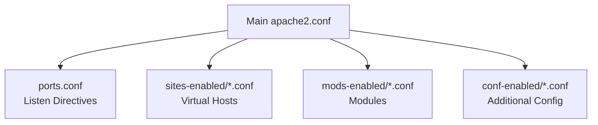
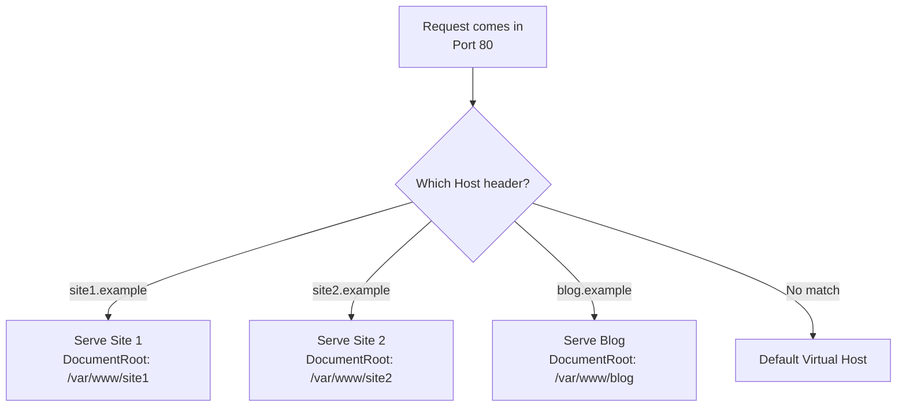
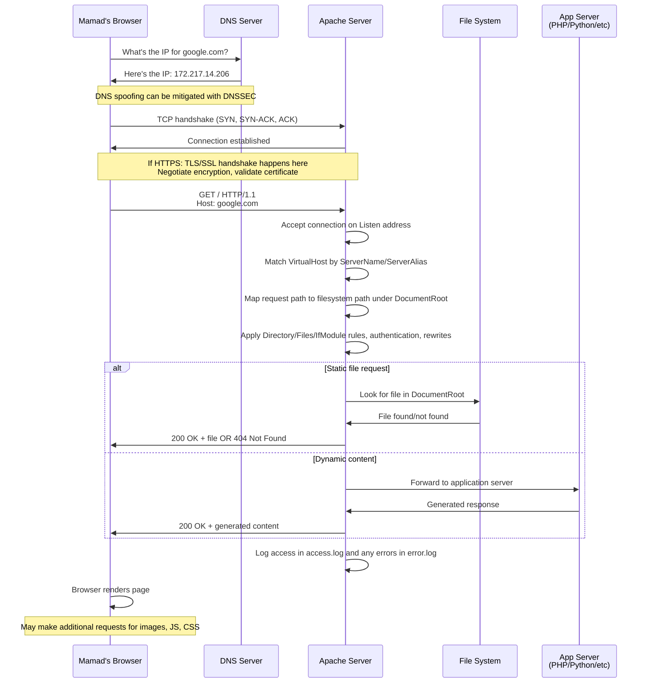
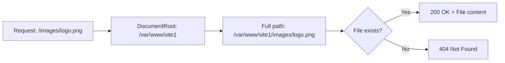

# Understanding Web Servers: My Apache Learning Journey

```markdown
<!-- meta: Learn how Web Servers really works! web server security owasp , beginner apache configuration -->
```

---


## What Actually Is a Web Server?

A **web server** is basically a program that serves up resources (files like HTML pages, images, CSS) to users over the **HTTP** (or HTTPS) protocol. Think of it like a waiter at a restaurant - clients come in with requests, and the server delivers what they ordered.

When you type something like `google.com` in your browser, here's what happens behind the scenes:
- Clients (that's your browser) reach the server via an IP address (or domain name)  
- They connect over **TCP**
- If HTTPS is used, a TLS/SSL handshake happens before any HTTP data gets exchanged

**Examples of web servers:** Apache (what I'm focusing on in this course) and nginx (which is often used as a load-balancer or reverse proxy).


**My goal here:** Get familiar with Apache **configuration** and basic behavior so when I open an Apache config file, I don't get lost. I want to recognize the important parts and understand what they actually do.

## How Apache Configuration Actually Works

Apache has this neat modular setup. There's a main configuration file (commonly called `apache2.conf` or `httpd.conf`) and many sub-configuration files that get pulled in. It's like having a main recipe that references other recipe cards for different parts of the meal.

Apache uses things called **directives** - these are basically configuration commands that change settings. Two really useful include-style directives I learned about:

### Include vs IncludeOptional

- `Include`: unconditionally include another config file
- `IncludeOptional`: include another config file **if it exists** (no error if missing)

Here's a simple example:
```apache
IncludeOptional sites-enabled/*.conf
```

This means "load all files matching `sites-enabled/*.conf` if they exist." Pretty neat, right?



## The Important Directives I Had to Learn

Let me walk you through each directive with simple examples that actually make sense:

### DocumentRoot - Where Your Website Files Live

This is the directory where served files live - basically the root folder for requests.

```apache
DocumentRoot "/var/www/site1"
```

Here's how it works: If a user requests `/` and Apache finds `/var/www/site1/index.html`, it returns that file. Simple as that!

Let me give you a concrete example:
- Someone types `http://mysite.com/about.html` in their browser
- Apache looks in `/var/www/site1/about.html`
- If the file exists → sends back the file with `200 OK`
- If it doesn't exist → sends back `404 Not Found`

**OWASP security note I learned:** Keep sensitive files outside `DocumentRoot`. Don't store `.env` files, database backups, or private keys in the document root where people can potentially access them!

### ServerName - Your Website's Identity  

This is the hostname for a virtual host (used for name-based virtual hosts).

```apache
ServerName example.com
```

Think of this as your website's ID card. When multiple sites share the same server, Apache uses this to figure out which site someone is trying to reach.

### Listen - Opening the Door

This tells Apache which IP and port to accept connections on.

```apache
Listen 80
Listen 443
# or bind to a specific IP:
Listen 192.0.2.10:8080
```

Port 80 is for regular HTTP, port 443 is for HTTPS (the secure stuff). The specific IP example is useful if your server has multiple network interfaces.

### ErrorLog - When Things Go Wrong

This is the path where error logs go.

```apache
ErrorLog ${APACHE_LOG_DIR}/site1-error.log
```

**OWASP note:** Keep logs for auditing and incident investigation. But also protect log files from unauthorized access - you don't want attackers reading your logs to learn about your system!

### Include and IncludeOptional (Again, Because They're Important)

As I mentioned above: include external config files. `IncludeOptional` avoids errors if the file is missing.

```apache
Include /etc/apache2/common.conf
IncludeOptional /etc/apache2/sites-enabled/*.conf
```

This is super useful for organizing your configuration. Instead of one giant file, you can break things up logically.

### Directory - The Security Guards

This is an enclosure that applies directives to a filesystem directory. Super useful to control access, options, and overrides.

```apache
<Directory "/var/www/site1">
    Options -Indexes +FollowSymLinks
    AllowOverride None
    Require all granted
</Directory>
```

Let me break down each part:
- `Options -Indexes`: disable directory listing (this is important for security!)
- `AllowOverride None`: disable `.htaccess` overrides (recommended for predictability)  
- `Require all granted`: allow access from everyone

**OWASP security insight:** Never allow `Indexes` unless you actually want people browsing through your directory contents. Also, limiting `AllowOverride` reduces your attack surface.

### Files - File-Level Control

This limits the scope of enclosed directives by filename pattern.

```apache
<Files ~ "\.env$">
    Require all denied
</Files>
```

This example denies access to any `.env` file. Super important for keeping environment variables with database passwords and API keys safe!

Here's another useful example:
```apache
<Files ~ "\.git">
    Require all denied
</Files>
```

This blocks access to git repository files that might contain sensitive information.

### IfModule - Conditional Configuration

This applies enclosed directives only if a module is loaded.

```apache
<IfModule mod_headers.c>
    Header always set X-Content-Type-Options "nosniff"
</IfModule>
```

This is great because if someone doesn't have the headers module installed, the config won't break - it just skips this section.

## Other Useful Directives and Settings I Discovered

Here are some other important ones that came up in my learning:

- `ServerTokens Prod` — reduce information leaked in server response headers (makes it harder for attackers to fingerprint your server)
- `ServerSignature Off` — disable server signature on error pages (again, less info for attackers)
- `CustomLog` — define access log format and location  
- `Timeout` — request timeout (how long to wait for slow requests)
- `KeepAlive`/`MaxKeepAliveRequests` — tuning persistent connections (performance stuff)

**OWASP note:** Minimizing server fingerprinting helps reduce reconnaissance value to attackers. Basically, the less they know about your setup, the harder it is for them to find vulnerabilities.

## Virtual Hosts - Multiple Sites, One Server  

This was one of the coolest things I learned! Virtual hosts let you host multiple domains on one server (same IP and port). Most web hosting companies use this approach.

There are two common types:
- **Name-based virtual hosts**: multiple hostnames share the same IP and port; Apache uses the `Host` header to pick the right virtual host
- **IP-based virtual hosts**: different IP addresses per host (less common nowadays)



### Simple Apache Name-Based Virtual Host Example

Here's how I set up two different sites on one server:

**Site 1:** `/etc/apache2/sites-available/site1.conf`
```apache
<VirtualHost *:80>
    ServerName site1.example
    ServerAlias www.site1.example
    DocumentRoot /var/www/site1
    ErrorLog ${APACHE_LOG_DIR}/site1-error.log
    CustomLog ${APACHE_LOG_DIR}/site1-access.log combined
    <Directory /var/www/site1>
        Options -Indexes +FollowSymLinks
        AllowOverride None
        Require all granted
    </Directory>
</VirtualHost>
```

**Site 2:** `/etc/apache2/sites-available/site2.conf`
```apache
<VirtualHost *:80>
    ServerName site2.example
    DocumentRoot /var/www/site2
    ErrorLog ${APACHE_LOG_DIR}/site2-error.log
    CustomLog ${APACHE_LOG_DIR}/site2-access.log combined
</VirtualHost>
```

To enable both sites (on Debian/Ubuntu systems):
```bash
sudo a2ensite site1 && sudo a2ensite site2 && sudo systemctl reload apache2
```

If you're not using Debian/Ubuntu, the same idea applies: drop the virtual host file into your config and reload Apache.

**OWASP note:** Each virtual host should have separate logs and a minimal set of enabled modules. Use HTTPS for every virtual host - there's really no excuse not to these days!

## What Happens When Someone Visits Your Website?

Let me walk through the complete journey of what happens when someone (let's call him Mamad) wants to visit `google.com`. I'll expand this example with clear steps:



**Detailed step-by-step breakdown:**

1. **DNS lookup**: Mamad's browser asks DNS for `google.com` → receives an IP address
   *OWASP note:* DNS spoofing can be mitigated with DNSSEC and using trusted resolvers

2. **TCP handshake**: Browser opens a TCP connection to the IP on port 80/443 (SYN, SYN-ACK, ACK)

3. **TLS/SSL handshake** (if HTTPS): negotiate encryption, validate certificate, establish secure channel

4. **HTTP request**: Browser sends an HTTP request like `GET / HTTP/1.1` with `Host: google.com` header

5. **Apache processing**:
   - Accepts connection on the `Listen` address
   - Matches VirtualHost by `ServerName`/`ServerAlias` or falls back to default virtual host
   - Maps the request path to a filesystem path under `DocumentRoot`, or forwards request to backend (proxy, fastcgi, etc)
   - Applies directory/File/IfModule rules, authentication, rewrites, and access controls
   - Serves the static file or forwards to application server (PHP, Python, etc) and gathers response

6. **Response & Logging**: Apache returns HTTP response, sets headers, and logs access/errors

7. **Browser renders page** and may make additional requests for images, JavaScript, CSS, then repeat the whole flow for each resource

## DocumentRoot - How File Mapping Actually Works

Let me give you a super simple example of how this mapping works:

If your virtual host has:
```apache
<VirtualHost *:80>
    ServerName site1.example
    DocumentRoot /var/www/site1
</VirtualHost>
```

And someone makes this request:
- **Request**: `GET /images/logo.png HTTP/1.1` with `Host: site1.example`
- **Apache looks for**: `/var/www/site1/images/logo.png`
- **If file exists** → send `200 OK` and contents
- **If it doesn't exist** → send `404 Not Found` (unless other rules rewrite it)



**OWASP note:** Put only public assets in `DocumentRoot`. Application code that shouldn't be served directly should live outside it (or be protected via configuration).

## Security Deep Dive (The OWASP Stuff)

This is where things get really interesting from a security perspective:

### How Apache Handles Privileges

Apache typically **starts as root** to bind privileged ports (like 80, 443), then switches to an unprivileged user (commonly `www-data` or `apache`) using `setuid`/process privilege drop. This is normal and expected behavior!

Here's what `setuid` means: it allows executing a program with the privileges of its owner. So Apache's parent process uses root privileges to bind to port 80, but the worker processes that actually handle requests run as unprivileged users. Smart design!

### File Ownership and Permissions

This was a big learning point for me:

- Web files should be owned by a deploy user
- Make them group readable by the Apache user  
- Never, ever use `chmod 777` (that's like leaving your house unlocked)

Example command:
```bash
chown -R deploy:deploy /var/www/site1
chmod -R 644 /var/www/site1  # Files readable by owner and group
chmod -R 755 /var/www/site1  # Directories executable by owner and group
```

### Essential Security Measures

**Disable unnecessary modules:** Fewer modules = smaller attack surface. Only load what you need.

**Use a Web Application Firewall (WAF):** Something like `mod_security` for extra protections.

**Ensure TLS configuration is modern:** Strong ciphers, certificates from trusted Certificate Authorities, and enable HSTS (HTTP Strict Transport Security).

### Security Headers Configuration

Add these security headers to protect your users:

```apache
<IfModule mod_headers.c>
    # Prevent MIME-type sniffing attacks
    Header always set X-Content-Type-Options "nosniff"
    
    # Prevent clickjacking attacks  
    Header always set X-Frame-Options "SAMEORIGIN"
    
    # Control referrer information leakage
    Header always set Referrer-Policy "no-referrer-when-downgrade"
    
    # Enable browser XSS filtering
    Header always set X-XSS-Protection "1; mode=block"
    
    # Content Security Policy (start simple, then tighten)
    Header always set Content-Security-Policy "default-src 'self'"
    
    # Force HTTPS (only for HTTPS sites)
    Header always set Strict-Transport-Security "max-age=31536000; includeSubDomains"
</IfModule>
```

Let me explain what each of these does:
- **X-Content-Type-Options**: Stops browsers from trying to guess file types (which can be exploited)
- **X-Frame-Options**: Prevents your site from being embedded in frames on other sites (clickjacking protection)  
- **Referrer-Policy**: Controls what referrer information gets sent to other sites
- **X-XSS-Protection**: Enables the browser's built-in XSS filter
- **Content-Security-Policy**: Controls what resources the browser can load (very powerful!)
- **Strict-Transport-Security**: Forces browsers to use HTTPS for your site

### Additional Security Configurations

**Disable directory indexing and .htaccess overrides:**
```apache
<Directory "/var/www">
    Options -Indexes +FollowSymLinks
    AllowOverride None
    Require all denied
</Directory>

<Directory "/var/www/html">  
    Require all granted
</Directory>
```

**Block sensitive files:**
```apache
# Block version control directories
<DirectoryMatch "\.git">
    Require all denied
</DirectoryMatch>

# Block common sensitive file patterns
<FilesMatch "^\.">
    Require all denied
</FilesMatch>

<Files ~ "\.(env|log|ini|conf|bak)$">
    Require all denied
</Files>
```

**Hide server information:**
```apache
ServerTokens Prod
ServerSignature Off
```

**Keep Apache and modules up to date:** This is crucial - security patches are released regularly.

## My Complete Security Checklist

Here's my mini security checklist that I use now:

- ✅ Disable directory listing: `Options -Indexes`
- ✅ Disable server tokens: `ServerTokens Prod` and `ServerSignature Off`  
- ✅ Use `AllowOverride None` (prefer central config over `.htaccess`)
- ✅ Restrict access with `<Directory>` and `<Files>` blocks
- ✅ Use `mod_headers` to set security headers
- ✅ Use `mod_security` (WAF) if available
- ✅ Configure strong TLS (disable old TLS/SSL versions)
- ✅ Regularly patch Apache and all modules
- ✅ Protect log files and implement log rotation  
- ✅ Keep secrets out of `DocumentRoot`
- ✅ Set proper file ownership and permissions
- ✅ Only load necessary modules

## Quick Examples for Each Directive

Let me give you quick, clear examples for each directive I mentioned:

**DocumentRoot example:**
```apache
DocumentRoot "/var/www/html"
# Now requests to / look in /var/www/html/
```

**ServerName example:**  
```apache
ServerName mysite.example
# This virtual host responds to mysite.example
```

**Listen example:**
```apache
Listen 443
# Apache accepts HTTPS connections on port 443
```

**ErrorLog example:**
```apache
ErrorLog /var/log/apache2/error.log  
# Errors get written to this file
```

**Include/IncludeOptional example:**
```apache
IncludeOptional conf.d/*.conf
# Load all .conf files in conf.d/ if they exist
```

**Directory example:**
```apache
<Directory "/var/www/html">
    Options -Indexes
    Require all granted
</Directory>
# No directory listing, but allow access to files
```

**Files example:**
```apache
<Files "secret.txt">
    Require all denied
</Files>  
# Nobody can access secret.txt
```

**IfModule example:**
```apache
<IfModule mod_rewrite.c>
    RewriteEngine On
</IfModule>
# Only enable URL rewriting if the module is loaded
```

## Glossary - Key Terms I Had to Learn

- **Web server**: software that serves web content over HTTP(S)
- **DocumentRoot**: folder where public files live  
- **Virtual host**: configuration that serves one hostname (domain)
- **Directive**: a configuration command (like `Listen`, `ServerName`)
- **setuid**: running code with the permissions of the program owner (used when Apache drops privileges)
- **Privileged ports**: network ports < 1024 (require root to bind to them)
- **TLS/SSL**: encryption protocols that make HTTP into HTTPS
- **WAF**: Web Application Firewall - extra security layer
- **HSTS**: HTTP Strict Transport Security - forces browsers to use HTTPS

## What I'm Taking Away

Learning Apache configuration isn't as intimidating as I thought it would be. The key insights I gained:

1. **Everything is about file mapping**: Apache takes URLs and maps them to files on disk
2. **Security should be built-in from the start**: Every directive has security implications  
3. **Virtual hosts are incredibly powerful**: One server can host many different websites
4. **Logs are crucial**: Both for debugging and security monitoring
5. **The principle of least privilege applies everywhere**: Only give access to what's needed

The OWASP security perspective makes this way more interesting than just "here's how to serve files." When you think about each configuration from an attacker's point of view, you make much better decisions.

I'm excited to apply this knowledge in real projects and continue learning about web security. Next up: diving deeper into application-level security!

---

## Quick Reference Card

**Essential directives:**
```apache
DocumentRoot "/var/www/html"        # Where files live
ServerName mysite.example           # Site identity  
Listen 443                         # Port to listen on
ErrorLog /path/to/error.log        # Error logging
```

**Security must-haves:**
```apache
Options -Indexes                   # No directory listing
ServerTokens Prod                 # Hide server info
AllowOverride None               # Disable .htaccess
Require all denied              # Default deny access
```

**Virtual host template:**
```apache
<VirtualHost *:80>
    ServerName example.com
    DocumentRoot /var/www/example
    ErrorLog ${APACHE_LOG_DIR}/example-error.log
    CustomLog ${APACHE_LOG_DIR}/example-access.log combined
</VirtualHost>
```

This journey through Apache has been eye-opening, and I hope sharing my learning process helps others who are just starting out with web server configuration!